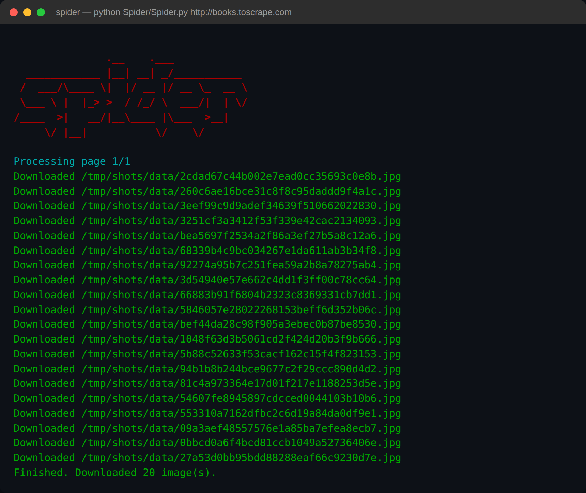
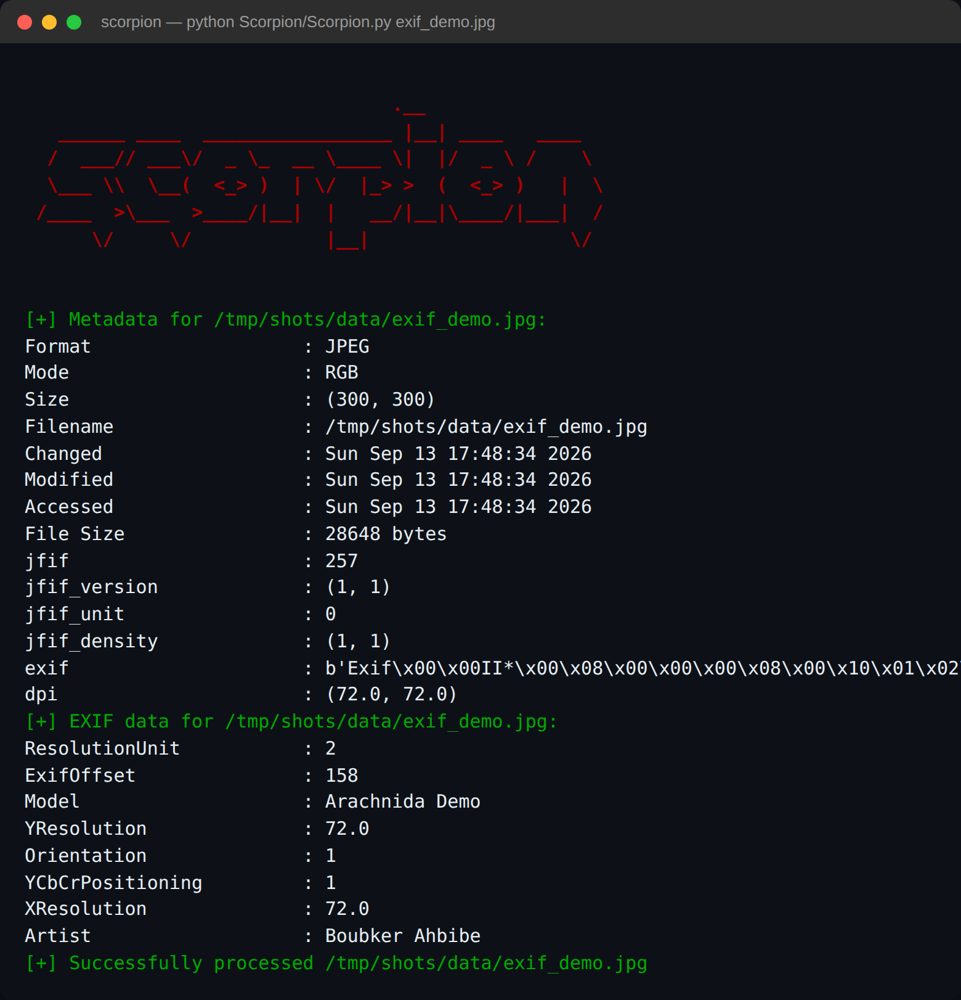
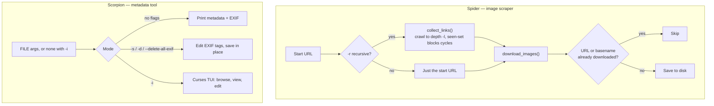

# Arachnida

Two small, dependency-light CLI tools: scrape images off a website, then read, edit, or wipe what's hidden inside them.


## Screenshots

| | |
|---|---|
| **Spider** crawling and downloading |  |
| **Scorpion** reading full metadata + EXIF |  |

## Quick start

```bash
git clone https://github.com/bahbibe/arachnida.git
cd arachnida
python3 -m venv .venv
source .venv/bin/activate
pip install -r requirements.txt

python Spider/Spider.py https://example.com
python Scorpion/Scorpion.py data/some-image.jpg
```

### Running tests

```bash
pip install -r requirements-dev.txt
python -m pytest tests/ -v
```

Tests mock all network calls, so they run offline and don't touch a real website.

## How it works



## Tools

### Spider

Scrapes images from a website, with optional recursive crawling.

```bash
# Scrape images from a single page
python Spider/Spider.py <URL>

# Recursively scrape images (default depth: 5)
python Spider/Spider.py -r <URL>

# Set recursion depth
python Spider/Spider.py -r -l 3 <URL>

# Specify output directory
python Spider/Spider.py -p ./my_images/ <URL>

# Download all file extensions (not just defaults)
python Spider/Spider.py --all <URL>

# Download only specific extensions
python Spider/Spider.py -e ".jpg,.png,.webp" <URL>

# Show verbose progress output
python Spider/Spider.py -v <URL>

# Full options
python Spider/Spider.py -r -l 3 -p ./data/ https://example.com
```

**Options:**

| Flag | Description |
|------|-------------|
| `URL` | Target URL (required) |
| `-r, --recursive` | Enable recursive crawling |
| `-l, --level` | Recursion depth (default: 5) |
| `-p, --path` | Output directory (default: `./data/`) |
| `--all` | Download all file extensions |
| `-e, --extensions` | Comma-separated extensions (e.g. `.jpg,.png,.webp`) |
| `-v, --verbose` | Show detailed progress output |

**Validation:** the target URL must be a valid URL, `--all` and `-e` cannot be used together, and `-l` must be a non-negative integer — invalid input prints an error and exits with a non-zero status.

### Scorpion

Reads, sets, and deletes EXIF/metadata on local images, with an interactive terminal UI.

```bash
# Read metadata from a single image
python Scorpion/Scorpion.py image.jpg

# Read metadata from multiple images
python Scorpion/Scorpion.py image1.jpg image2.png image3.jpeg

# Accept all file extensions
python Scorpion/Scorpion.py --all image.webp image.tiff

# Accept only specific extensions
python Scorpion/Scorpion.py -e ".jpg,.png,.webp" image.jpg

# Set/modify an EXIF tag
python Scorpion/Scorpion.py -s Artist=YourName image.jpg

# Delete a specific EXIF tag
python Scorpion/Scorpion.py -d GPSInfo image.jpg

# Delete all EXIF tags
python Scorpion/Scorpion.py --delete-all-exif image.jpg

# Launch the interactive terminal UI to view/manage metadata
python Scorpion/Scorpion.py -i image1.jpg image2.png
```

**Options:**

| Flag | Description |
|------|-------------|
| `FILE` | Image file(s) to process (required unless `-i` is used alone) |
| `--all` | Accept all file extensions |
| `-e, --extensions` | Comma-separated extensions (e.g. `.jpg,.png,.webp`) |
| `-s, --set` | Set/modify an EXIF tag, `TAG=VALUE` (repeatable) |
| `-d, --delete` | Delete an EXIF tag by name (repeatable) |
| `--delete-all-exif` | Delete all EXIF tags from the file(s) |
| `-i, --tui` | Launch an interactive terminal UI to view/manage metadata |

Running `-i` with no `FILE` browses image files in the current directory; with exactly one `FILE` it opens straight to that file's detail view.

**TUI controls:** arrow keys / `j`/`k` to move, `Enter` to open a file, `s` to set a tag, `d` to delete a tag, `x` to delete all EXIF, `b`/`Esc` to go back (`Esc` also cancels a text prompt), `q` to quit.

**Default supported formats:** `.jpg`, `.jpeg`, `.png`, `.gif`, `.bmp`

**Output includes:** format, mode, size, filename, changed/modified/accessed timestamps, file size, EXIF data (when available), and a per-file success/error status line.

**Validation:** `--all` and `-e` cannot be used together, and each file must exist and have a supported extension — invalid files are skipped with an error message rather than aborting the run.

## Notable bits

- **Cycle-safe recursion.** `collect_links()` threads a single `seen` set through its own recursive calls, so a crawl can't loop forever on pages that link back to each other. Tested against a 1000-page site (`books.toscrape.com`) at depth 2: it queued 1100+ images with zero crashes and zero duplicate writes before being stopped manually.
- **Dual-key dedup.** Downloads are deduped on both the source URL and the output basename, so two different URLs that would resolve to the same filename don't silently overwrite each other on disk.
- **In-place EXIF editing without exiftool.** `set_exif_tag`/`delete_exif_tag` work straight off Pillow's `Image.Exif` object (`getexif()` / `exif.tobytes()`), with a small tag-name-to-id table so you can write `-s Artist=Name` instead of a numeric tag ID. Verified end-to-end: set a tag, read it back, deleted it, wiped all EXIF, confirmed each step against a real JPEG's binary EXIF block.
- **Zero-dependency TUI.** The `-i/--tui` interface is built on the stdlib `curses` module alone — no urwid, no textual. Its text-input prompts are hand-rolled over a `getch()` loop specifically so Esc can cancel mid-entry, which curses' built-in `getstr()` can't do.
- **Defensive HTTP.** Every request rotates a random user-agent and carries a 3s connect / 10s read timeout, and a failed page or image fetch is skipped rather than aborting the whole crawl.

## Dependencies

| Package | Purpose |
|---------|---------|
| requests | HTTP requests |
| beautifulsoup4 | HTML parsing |
| validators | URL validation |
| fake-useragent | Random user-agent rotation |
| colorama | Colored terminal output |
| pillow | Image EXIF/metadata extraction |

`Scorpion`'s TUI uses only the Python standard library (`curses`) beyond that.

## Notes

- All HTTP requests include a random user-agent header to avoid being blocked
- Requests have a timeout of 3s (connect) and 10s (read) to prevent hanging
- Only image files with valid extensions are downloaded by default (`.jpg`, `.jpeg`, `.png`, `.gif`, `.bmp`)
- Use `--all` to download any file extension, or `-e` to specify custom ones
- Images are saved with their original filenames (query params stripped)
- Duplicate URLs and duplicate output filenames are tracked to prevent redundant/overwriting downloads

## License

MIT — see [LICENSE](LICENSE).
